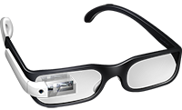
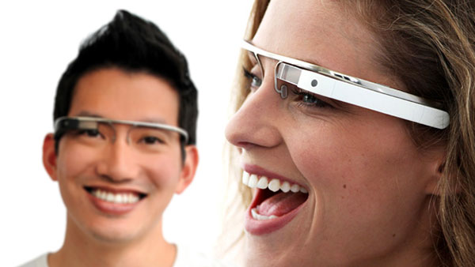

 

  

# Projeto Site Google Glass
	

	Projeto site google Glass feito para aprendizagem e informações sobre o tema google glass.

 
	
## 🚀 Tecnologias:
		
<ul>
<li>HTML5</li>
<li>CSS3</li>
<li>JAVASCRIPT</li>
</ul>

 

<h1 align='center'><strong>Apresentação resumida do site:</strong></h1>

 
 

<hgroup>   
	<h2>A revolução do Google está chegando</h2>
	
</hgroup>

<h2>O que é Google Glass</h2>
 
O <b>Google Glass</b> é um acessório em forma de óculos que possibilita a interação dos usuários com diversos conteúdos em realidade aumentada. Também chamado de <a href="http://glass.google.com" target="_blank"><i>Project Glass</i></a>, o eletrônico é capaz de tirar fotos a partir de comandos de voz, enviar mensagens instantâneas e realizar vídeo&shy;con&shy;ferên&shy;cias. Seu lançamento está previsto para 2014, e seu preço deve ser de US$ 1,5 mil. Atualmente o <em> Google Glass</em> encontra-se em fase de testes e já possui um vídeo totalmente gravado com o dispositivo. Além disso, a companhia de buscas registrou novas patentes anti-furto e de desbloqueio de tela para o acessório.

 
 <figure class="foto-legenda">
 	
	<h6><strong>Uma nova maneira de ver o mundo.<strong></h6>	
 </figure>
  

 <h2>Como funciona</h2>
 
De acordo com fontes próximas do Google, os óculos vão contar com uma pequena tela de LCD ou AMOLED na parte superior e em frente aos olhos do usuário. Com o uso de uma câmera e GPS, você pode se situar, assim como selecionar opções com o movimento da cabeça

  

## 📝 Licença

Esse projeto está sob a licença MIT. Veja o arquivo [LICENSE](.github/LICENSE.md) para mais detalhes.
		
 		

#### Como baixar o projeto: git clone https://github.com/AlanFaraj83/ProjetoGoogleGlass.git		
		
		

 
		
               
  
    
   

  

	
	
